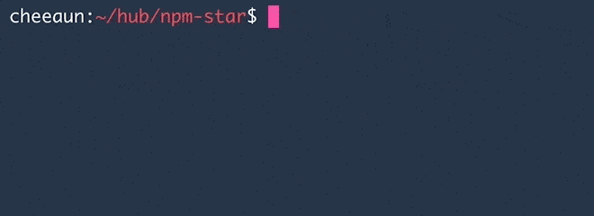

npm-star [](https://www.npmjs.com/package/npm-star)
===

> Star GitHub repositories of your project's npm dependencies. First inspired by [bundle-star](https://github.com/ma2gedev/bundle-star).



Install
---

```
npm install --global npm-star
# or
yarn global add npm-star
```

### Local install

```
npm install --save-dev npm-star
# or
yarn add --dev npm-star
```

Usage
---

### Setup a `.netrc` file

`npm-star` depends on `.netrc` to access the GitHub API. Put your GitHub credentials into `.netrc` file (located at `~/.netrc`), so that you can access the GitHub API.

Here's a sample `.netrc` file. Execute `chmod 600 ~/.netrc` to avoid permission error.

```
machine api.github.com
  login <your github account>
  password <your github token, from <https://github.com/settings/tokens>
```

⚠️ **IMPORTANT**: Make sure `public_repo` is checked ✅ when creating a new token. This is needed for starring repositories 🌟.

### Use `npm-star` or `yarn-star`

```
npm-star
# or
yarn-star
```

If it's a local installation, add as `postinstall` script in `package.json` 😏:

```
"scripts": {
  ...,
  "postinstall": "npm-star"
}
```

Related
---

- [`bundle-star`](https://github.com/ma2gedev/bundle-star) - Star github repositories automatically when you bundle installing
- [`starring`](https://github.com/ritz078/starring) - Automatically star the npm-packages that you are using on GitHub.
- [`gh-star`](https://github.com/fedebertolini/gh-star) - NodeJS app that stars the GitHub repos referenced in a package.json file
- [Creating a personal access token for the command line](https://help.github.com/articles/creating-a-personal-access-token-for-the-command-line/)
- [The `.netrc` file](https://www.gnu.org/software/inetutils/manual/html_node/The-_002enetrc-file.html)

License
---

[MIT](https://cheeaun.mit-license.org/) © [Lim Chee Aun](http://cheeaun.com)
